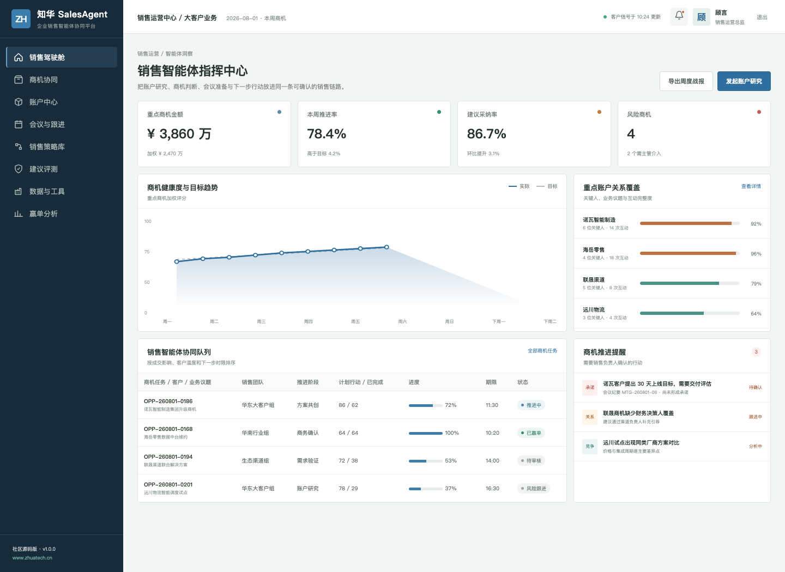
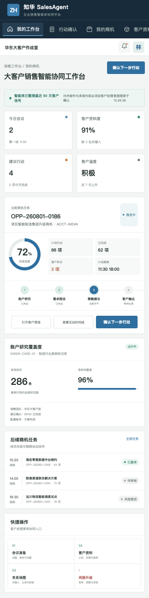

# ZhuaTech SalesAgent

## 给 B2B 销售团队一位“先研究、后建议”的智能协作伙伴

知华科技 SalesAgent 社区源码版围绕账户研究、商机策略、会议准备、跟进行动和客户内容审批展开。智能体整理事实并提出下一步行动，客户经理保留客户关系、承诺和最终判断。

> 产品与定制服务：[知华科技（上海如静知华信息科技有限公司）官网](https://www.zhuatech.cn/)



### 适用场景

- 汇总客户公告、CRM 互动、会议纪要和已授权资料
- 生成账户简报、关键人地图、需求假设与会议问题
- 识别商机停滞、竞争、预算和决策链风险
- 推荐 Next Best Action，并由销售确认责任人与截止日
- 对外邮件、方案表述和商业承诺进入人工审批
- 复盘建议采纳、阶段转化、销售周期与赢单原因



Next Best Action 引擎会结合预计金额、赢率、停滞天数、决策人参与和竞争态势计算商机热度，输出行动清单及经理升级标记。它只提供可解释的销售建议，不替代客户经理作出价格、交付或合同承诺。

跟进节奏规划会结合商机阶段、停滞天数、未回复次数、干系人覆盖和下一次会议安排，生成带日期偏移、渠道与目的的多触点计划。连续三次未回复时系统会暂停自动触达，先交由客户经理复核，避免机械式营销影响客户关系。

### 工程速览

后端：Java 21 + Spring Boot + Spring Security + JWT + JPA + Flyway；包名 `cn.zhuatech.salesagent`。前端：Vue 3 + Pinia + Vue Router + Axios + Vite，支持桌面与 H5。数据库：MySQL 8，自动化测试使用 H2。`AgentRuntime` 提供可替换边界，默认仅运行本地演示流程，不接入真实 CRM、邮箱或模型服务。

```bash
cd frontend
npm install
npm run dev:demo
```

打开 `http://localhost:5173`，使用 `planner / Demo@2026` 查看销售运营端，使用 `operator / Demo@2026` 查看客户经理端。全栈部署见 [部署指南](deploy/README.md)，接口见 [API 文档](docs/api.md)。

### 非商业许可

本工程仅供个人学习、研究及非商业技术交流，**禁止商用**。企业内部使用、生产部署、项目交付、SaaS、收费服务、二次销售、品牌替换等均需获得上海如静知华信息科技有限公司书面授权；完整边界以 [LICENSE](LICENSE) 为准。

深度定制、私有化部署、商业授权与销售智能体实施，可通过[知华科技官网](https://www.zhuatech.cn/)或下方微信二维码联系。

| 商务与技术咨询 | 项目合作咨询 |
| --- | --- |
|  |  |

关键词：销售智能体源码、Sales Agent、B2B 销售助手、商机管理 AI、客户研究 Agent、Java Vue 销售系统、知华科技。
